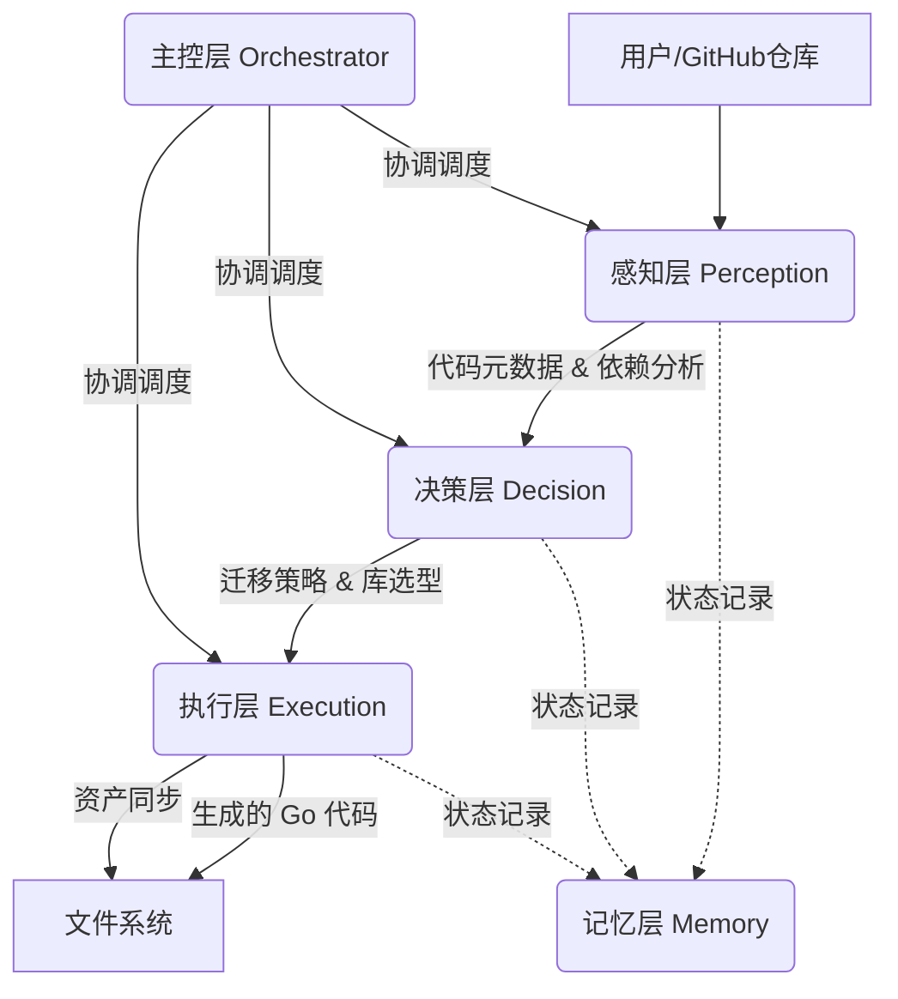

这是一个为你的 **多Agent Python转Go重构工具** 编写的专业 `README.md` 文档。

你可以将以下内容保存为 `README.md` 文件放在项目根目录下。我为你设计了清晰的项目介绍、架构图解、安装步骤和使用说明。

---

# 🚀 Py2Go-Refactor-Agent

**基于多Agent架构 (Multi-Agent) 的 Python 到 Go 智能重构系统**

[English](https://www.google.com/search?q=README_EN.md) | [中文](README.md)

`Py2Go-Refactor-Agent` 是一个高度自动化的代码迁移工具，旨在将 GitHub 上的 Python 项目转换为 idiomatic（地道的）Go 语言项目。

不同于简单的逐行翻译，本系统采用 **感知-决策-执行** 的多 Agent 架构，能够理解代码意图、分析依赖关系、制定迁移策略，并最终生成高质量的 Go 代码，同时完整保留项目原有的资源文件结构。

---

## ✨ 核心特性

* **🧠 智能感知层 (Perception Layer)**: 不仅仅是读取文件，通过 AI 分析代码的核心功能、复杂度及第三方依赖（如 `numpy`, `pandas` 等）。
* **⚖️ 策略决策层 (Decision Layer)**: 根据代码分析结果，动态生成迁移策略（如推荐对应的 Go 库、性能优化建议、Todo 列表）。
* **🔨 精准执行层 (Execution Layer)**: 遵循决策层的策略进行代码生成，确保逻辑正确且符合 Go 最佳实践。
* **📦 资产完整同步**: 自动识别并迁移非代码文件（配置、图片、数据集等），保持原有目录结构，确保项目可运行。
* **📊 详细迁移报告**: 任务结束后生成 JSON 格式的完整报告，记录成功率、转换策略及失败详情。

---

## 🏗 系统架构

本系统由五个核心层次组成，形成闭环工作流：



1. **感知层**: 负责“看”。调用 AI 理解代码意图。
2. **决策层**: 负责“想”。制定 `numpy` -> `gonum` 等库替换方案。
3. **执行层**: 负责“做”。生成代码并处理文件 IO。
4. **记忆层**: 负责“记”。保存上下文，生成最终报告。
5. **主控层**: 指挥官。初始化各层并管理数据流。

---

## 🛠️ 安装与配置

### 前置要求

* Python 3.8+
* Git
* MiMo API Key (或兼容 OpenAI 格式的其他 API Key)

### 安装步骤

1. **克隆本项目**
```bash
git clone https://github.com/your-username/py2go-agent.git
cd py2go-agent

```


2. **安装依赖**
```bash
pip install openai

```


3. **配置 API Key**
建议将 API Key 设置为环境变量：
```bash
# Linux/macOS
export MIMO_API_KEY="sk-xxxxxxxxxxxxxxxx"

# Windows (PowerShell)
$env:MIMO_API_KEY="sk-xxxxxxxxxxxxxxxx"

```


---

## 💻 使用指南

运行 `converter.py` 即可启动重构流程。

### 基本用法

```bash
python converter.py <GitHub仓库URL> <本地保存路径>

```

### 示例

将一个 Flask 项目迁移到 Go：

```bash
python converter.py https://github.com/pallets/flask-example.git ./my_flask_go_project

```

### 参数说明

| 参数 | 说明 | 是否必填 |
| --- | --- | --- |
| `github_url` | 目标 Python 项目的 GitHub 地址 | ✅ 是 |
| `target_path` | 代码下载及转换结果的本地保存路径（需为空） | ✅ 是 |
| `--api_key` | 如果未设置环境变量，可在此传入 Key | ❌ 否 |

---

## 📂 输出结构

工具运行完成后，`target_path` 目录结构如下：

```text
./my_flask_go_project/
├── [原始 Python 文件...]       # 原始克隆的代码
├── go_converted/              # 🎯 转换结果目录
│   ├── main.go                # 转换后的 Go 代码
│   ├── utils/
│   │   └── helper.go
│   ├── static/                # 🖼️ 自动同步的资源文件
│   │   └── style.css
│   └── migration_report.json  # 📊 最终迁移报告
└── ...

```

---

## 📝 迁移报告示例 (`migration_report.json`)

```json
{
  "processed_files": 1,
  "details": [
    {
      "file": "app.py",
      "analysis": {
        "summary": "A simple web server using Flask.",
        "complexity": "Low",
        "dependencies": ["flask"]
      },
      "strategy": {
        "go_libraries": ["net/http", "github.com/gin-gonic/gin"],
        "todo_list": ["Replace Flask decorators with Gin routes"]
      },
      "status": "success"
    }
  ]
}

```

---

## ⚠️ 注意事项

1. **人工审查**: AI 生成的代码虽然质量较高，但无法保证 100% 可编译。请务必进行人工审查和依赖调整（`go mod tidy`）。
2. **复杂逻辑**: 对于元编程（Metaprogramming）或极度动态的 Python 特性，AI 可能会生成简化版本的 Go 代码或注释说明无法直接转换。
3. **API 成本**: 该工具会进行多次 AI 交互（分析+决策+执行），请注意 Token 消耗。

---

## 🤝 贡献

欢迎提交 Issue 和 PR！如果你有更好的 Prompt 策略或架构改进建议，请随时分享。

## 📄 许可证

MIT License